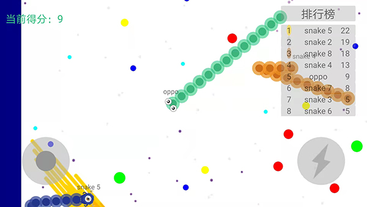
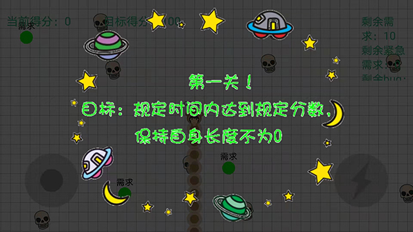

## Basic Instructions ##
This is an innovative game based on the traditional Snake game. The player must keep the snake from colliding with both other obstacles and itself, which gets harder as the snake lengthens. The player can get score by controling the snake to eat the "food" on the screen. However, in our new version, we make the game more interesting by adding some interactive play modes. Also, the language in this game is Chinese because this was developed during the time I lived in China.

- The main functions of this game are described in [Main Function Description](https://github.com/kunlunli/Personal-Project/tree/main/Snake_App/Main_Function_Description.md)
- There is a vedio demo showing how to play this game. Pls check [this](https://github.com/kunlunli/Personal-Project/tree/main/Snake_App/Vedio_demo.mp4)

## Rules ##
We have two different modes in this game. One is normal mode and the other is Innovative mode.

In order to control the snake, you can use the button on the buttom-left corner to control the direction and use the flash button on the buttom-right corner to accerate the snake.
### Normal Mode ###
In this mode, you can control the snake to eat "food" seperated on the all screen. All the other snakes are controlled by the computer and you have to avoid colliding with them. The real-time score will be shown on the top-right corner. And there will be no score limitation in this mode. Here is the picture of this mode:

### Innovative Mode ###
In this mode, I designed the snake as myself(which is why the snake has a monkey's head on it). The snake has a time limitation in order to stay alive. To postpone the time limitation, you will have to eat as much food as posible and avoid the troubles, which are symbled as the skeletons.

Food setting: In this mode, the snake is a programmer and the principles to live on is to finish as many requirements as possible as possible and solve the bugs before they turn urgent(red). 

#### Level setting: ####
In order to pass this mode, players will have to pass 3 levels. Each level has as time limitation and the player has to reach a curtain scores before that time. In order to obtain scores, you will have to eat as much "food" as posible and avoid the trouble, colliding with a skeleton will decrease your scores.

#### Obtaining Scores ####
In order to obtain scores, you will have to keep eating food. The food here represents the product requirements that a programer has to deliver. As we know, the requirements will become more and more urgent when it comes close to it's deadline. Correspondingly, the food's color will be green at first, and turn to blue after a while. Then, if the food is not consumed during a curtain time, it will diappear and you will lose some points because of the miss.

## How To Install ##
I also uplaod this app on my page. If you want to install it on your phone, pls download the [GluttonousSnake](https://github.com/kunlunli/Personal-Project/tree/main/Snake_App/GluttonousSnake.apk) document and then install it. It can only run on the Android mobile phones.